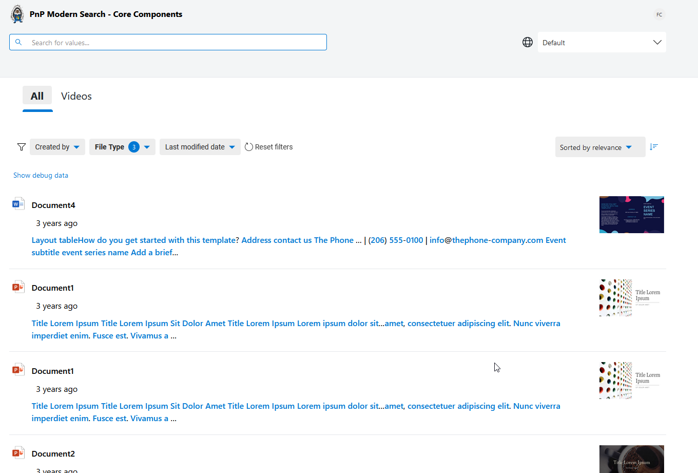

# PnP Modern Search - Core Components

> These components have been initially made by [Ubisoft](https://www.ubisoft.com/) as part of their Microsoft Search implementation. They've been adapted are given to the community for free. A big thanks to them! Sharing is caring.

    
   

   <picture>
      <source media="(prefers-color-scheme: dark)" srcset="./docs/assets/ubisoft_stacked_logo_white.png">
      <source media="(prefers-color-scheme: light)" srcset="./docs/assets/ubisoft_stacked_logo_black.png">
      
   </picture>

The goal is to provide reusable components based on Microsoft Search and Microsoft Graph in general that can be used transversally in an organization.

> Despite we provide a SharePoint WebParts implementation over these components, this **is not a new version, nor a replacement** of the [PnP Modern Search WebParts](https://github.com/microsoft-search/pnp-modern-search). The main difference is they can be used outside SharePoint to leverage Microsoft Graph and Microsoft Search.

## What are they and why should I use them?

These components are regular [web components](https://developer.mozilla.org/en-US/docs/Web/Web_Components) built on top of [Microsoft Graph Toolkit](https://learn.microsoft.com/en-us/graph/toolkit/overview) and [Lit elements](https://lit.dev/docs/).

They allow to consume Microsoft Search results in any web application, outside of SharePoint, for instance, to build custom search experiences.

   

## What components are included?

The following components are included in the bundle:

| Component | HTML tag | Purpose |
| --------- | -------- | ------- |
| [Search results](https://azpnpmodernsearchcoresto.z9.web.core.windows.net/latest/index.html?path=/docs/components-search-search-results--usage-query) | `<pnp-search-results>` | Display results from Microsoft Search index according to configured parameters. |
| [Search filters](https://azpnpmodernsearchcoresto.z9.web.core.windows.net/latest/index.html?path=/docs/components-search-search-filters--usage) | `<pnp-search-filters>` | Display filters from a connected search results components |
| [Search box](https://azpnpmodernsearchcoresto.z9.web.core.windows.net/latest/index.html?path=/docs/components-search-search-box--usage) | `<pnp-search-input>` | Allow users to enter free text search keywords.
| [Search verticals](https://azpnpmodernsearchcoresto.z9.web.core.windows.net/latest/index.html?path=/docs/components-search-search-verticals--usage) | `<pnp-search-verticals>`  | Displays tabs to search by verticals |
| [Video player](https://azpnpmodernsearchcoresto.z9.web.core.windows.net/latest/index.html?path=/docs/components-misc-video-player--usage) | `<pnp-video-player>`  | Play video from SharePoint (outside of SharePoint domain) |

##  How I get started?

To get started, simply follow the [guide](https://microsoft-search.github.io/pnp-modern-search-core-components/development/getting_started/)!

## Playground

You can also get an overview of components using the [playground](https://azpnpmodernsearchcoresto.z9.web.core.windows.net/latest/index.html?path=/docs/introduction-getting-started--docs)

Thank you to all [Ubisoft members who participate to this project](https://microsoft-search.github.io/pnp-modern-search-core-components/thanks/)!