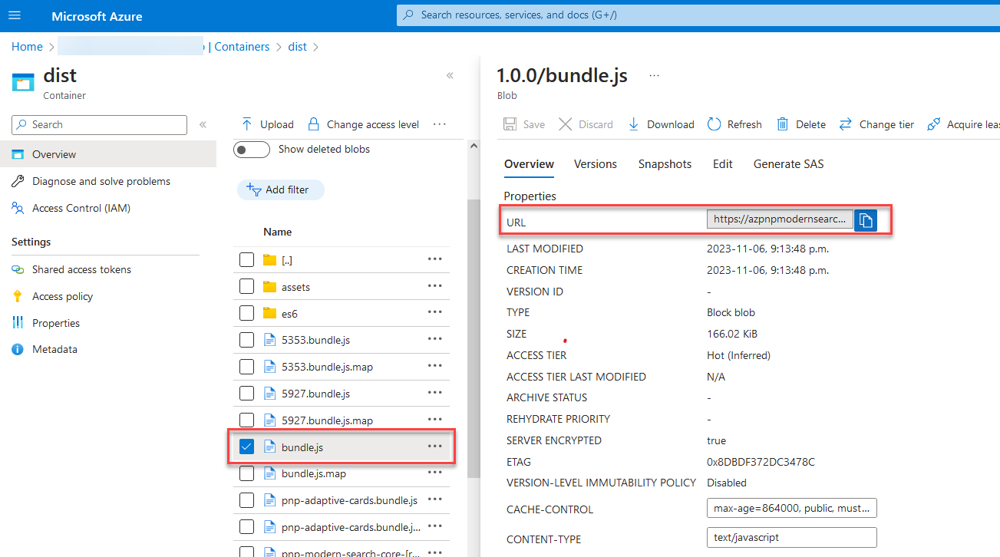
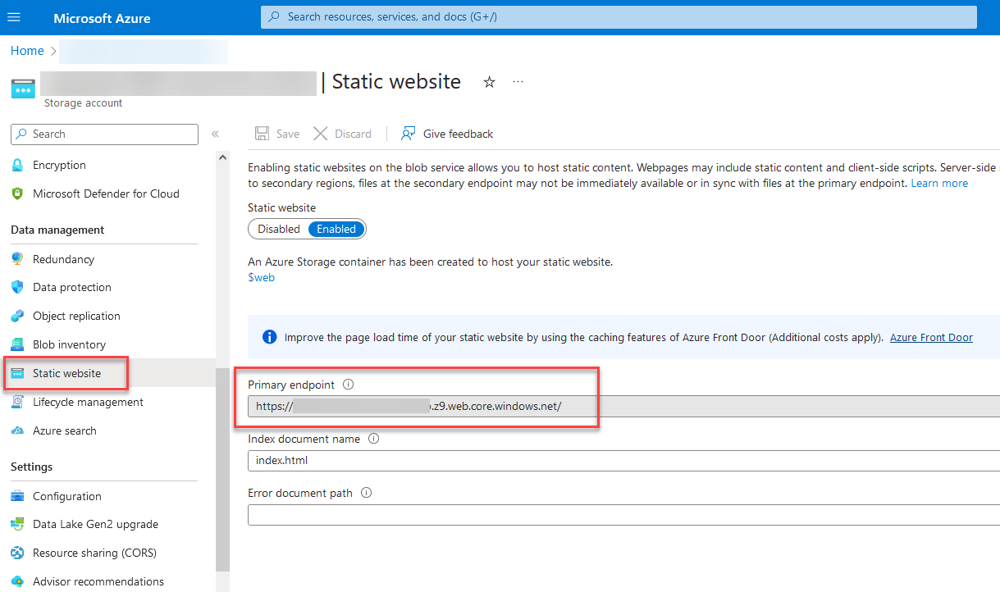

## Deploy components Javascript bundle

As of today, components Javascript bundle are not hosted on a publically accessible CDN. It means you can host them and consume them from your own environment (ex: Azure Blob Storage). We provide a deployment script to help you to deploy this solution to your Azure environment.

### Prerequisites: set up variables

All script parameters are managed trhough a PowerShell script with the following variables:  

| Variable name                    	| Description                                                                  	|
|----------------------------------	|------------------------------------------------------------------------------	|
| `$ENV_AzDeployAppId`               	| If the deployment is done by an application, the Azure App ID.                	|
| `$ENV_AzDeployAppCertificateValue` 	| If the deployment is done by an application, the Azure App certificate as base64 value. 	|
| `$ENV_AzDeployTenantId`            	| The Azure tenant ID where to deploy                                          	|
| `$ENV_AzDeploySubcriptionId`       	| The Azure subscription ID                                                    	|
| `$ENV_AzResourceGroupName`         	| The Azure resource group to use for deployment. Should exist before deployment.
| `$ENV_AzStorageAccountName`        	| The Azure storage account name to deploy to. Will be created if doesn't exist.                                  	|
| `$ENV_AzBlobContainerName`         	| The container name to deploy the components bundle. Will be created if doesn't exist.                         	|
| `$ENV_AzBlobContainerWebName`      	| The container bane to deploy the Storybook documentation (typically `$web`)  	|

To deploy from your local machine:

1. From the solution root folder, run `npx lerna run bundle:prod --scope=@pnp/modern-search-core`. This will bundle the components in production mode.
1. From the `/deploy` folder run the `deploy.ps1` script:

    `.\deploy.ps1 -Manual -Environement LOCAL -Version 0.0.0`

The script provisions the Azure Blob container if doesn't exist and upload the components Javascript bundle in folder according to the `variables.local|ci.ps1` parameters file.

| Variable name 	| Description                                                                                                                                                                                                                                                               	|
|---------------	|---------------------------------------------------------------------------------------------------------------------------------------------------------------------------------------------------------------------------------------------------------------------------	|
| `Env`         	| Environment where to deploy components. Use `LOCAL` to deploy with values from `variables.local.ps1`. Use `CI` to deploy with values from `variables.ci.ps1`                                                                    	|
| `Version`     	| Version to use for components. This will create a dedicated folder with ath version. Ex: `1.0.0`                                                                                                                                                                          	|
| `Manual`      	| Use this flag to do the deployment manually using an user account. In this case, you will be prompted for authentication. Without this flag, the script will try to deploy using an application according to `$ENV_AzDeployAppId` and `$ENV_AzDeployAppCertificateValue` 	|

Once deployed, you need to get the public URL of the bundle javascript file:

This URL should be included in your HTML pages where components are consumed.

!!! warning
    By default, Azure Blob container is publically accessible. Make sure you configure networking options at storage account level to change this behavior.

## Deploy Storybook playground

To deploy the Storybook documentation, follow these steps:

1. From the solution root folder, run:
    
    `npx lerna run docs:build --scope=@pnp/modern-search-core`

1. From the `/deploy` folder run the `deploy.ps1` script:

    `.\deploy-docs.ps1 -Manual -Env LOCAL -Version 0.0.0`

1. Once deploy, you can access the Storybook application from the static website URL + `/<version>/index.html` (ex: `https://<storage_account_name>.z9.web.core.windows.net/0.0.0/index.html`):

