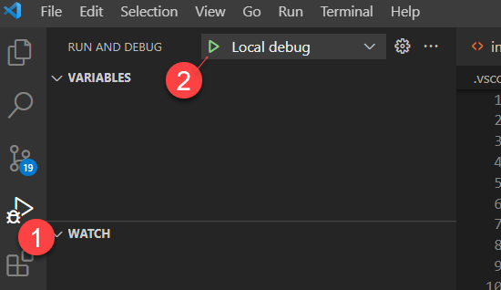
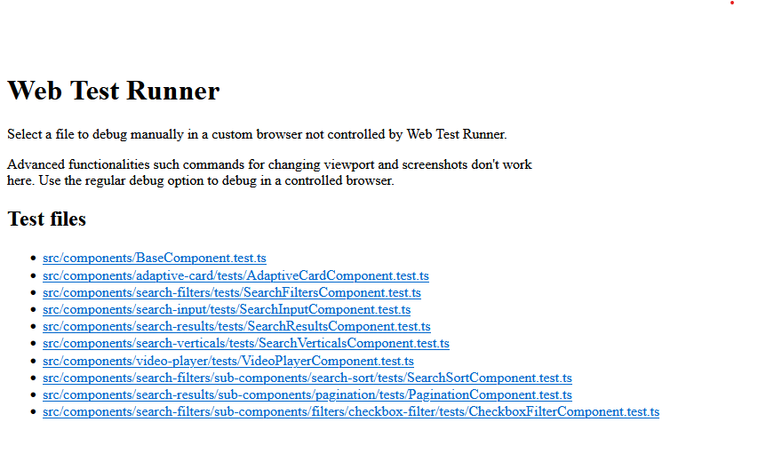
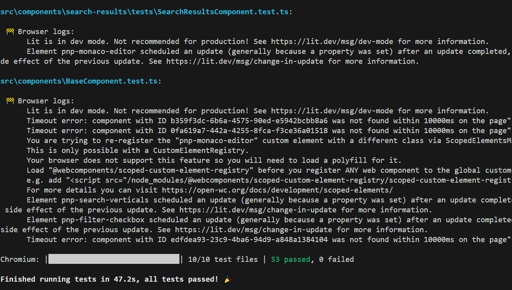
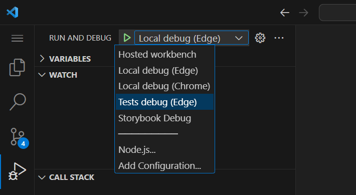
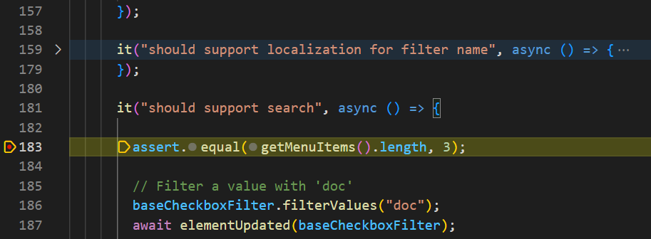
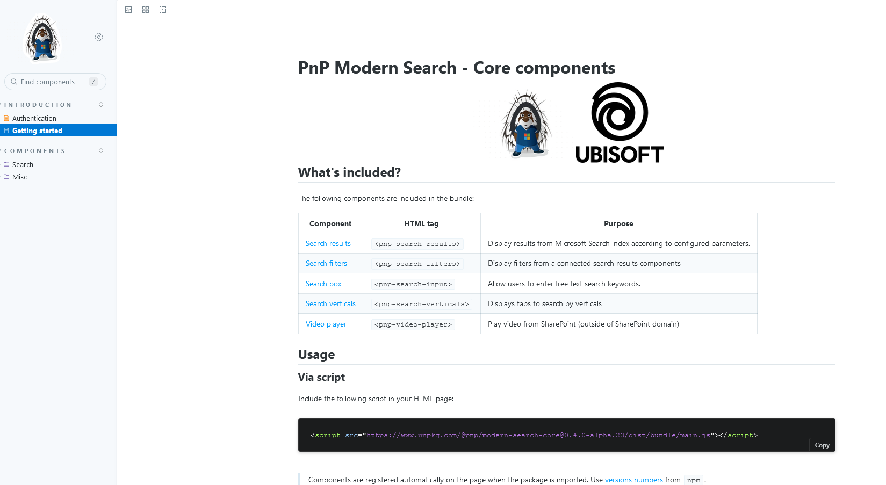
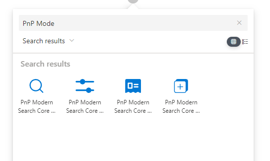

# Getting started

## Prerequisites

- [Visual Studio Code](https://code.visualstudio.com/) with the following recommended extensions installed:
    - [Bicep](https://marketplace.visualstudio.com/items?itemName=ms-azuretools.vscode-bicep)
    - [ESLint](https://marketplace.visualstudio.com/items?itemName=dbaeumer.vscode-eslint)
    - [lit-plugin](https://marketplace.visualstudio.com/items?itemName=runem.lit-plugin)
    - [Tailwind CSS IntelliSense](https://marketplace.visualstudio.com/items?itemName=bradlc.vscode-tailwindcss)
    - [PowerShell](https://marketplace.visualstudio.com/items?itemName=ms-vscode.PowerShell)
    - [MDX](https://marketplace.visualstudio.com/items?itemName=unifiedjs.vscode-mdx)
- Node.js v16.19.1 or higher

## Web components

### Run and debug the solution

1. Open the project root folder in Visual Studio Code.
1. From the _'Terminal'_ window, run the following command:

    `npx lerna run serve --scope=@pnp/modern-search-core`

    This will bundle the solution and serve it from a local server on adresss [http://localhost:8080/index.html](http://localhost:8080/index.html):

    

:::info Use **index.html** as your sandbox
    The `packages/components/dev/index.html` is a sandbox page, meaning you can update it any way you want to test components behavior. To know all available parameters for components, go to the "playground".
:::

1. To debug the components, start debugging using the **"Local debug (Edge|Chrome)"** configuration:

    

### Run and debug tests

1. Open the `packages/components` folder in Visual Studio Code.
1. From the 'Terminal', run the following command:

    `pnpm run test:watch`

    This will start tests in watch mode on the `http://localhost:8000/`. Choose then the test you want to debug:

    

    :::info
        To run all tests (ex: before a commit), run `npx lerna run test --scope=@pnp/modern-search-core`.
    :::
    
    
   
1. Launch the **"Debug tests Edge"** VSCode configuration and choose the test you want to debug:

    

1. Put breakpoints in your tests and refresh the page to trigger the test again:

    

### Run Storybook stories 

We use Storybook to demo components in different scenarios:

To run Storybook locally run the following command:

`npx lerna run docs:watch --scope=@pnp/modern-search-core`   

:::info
    All stories are read from the `packages/components/src/stories` folder.
:::

## SPFx Web Parts

### Run and debug the solution

1. Open the project root folder in Visual Studio Code.
1. From the 'Terminal', run the following command:

    `npx lerna run serve --scope=@pnp/modern-search-core-spfx`

1. You can also go directly to `packages/spfx` and run `pnpm run serve`.
1. Open the **Hosted workbench** debug configuration and add WebParts from Local category:

    

:::info
    If you need to work on both web components and Web Parts at the same time, you can run the following commands
    
    1. From `packages/components`, run `pnpm run build:watch` 
    1. From `pacakges/spfx`, run `pnpm run serve`
:::

## Docusaurus documentation

1. Open the project `documentation` folder in Visual Studio Code.
1. From the 'Terminal', run the following command:

    - `pnpm i`
    - `pnpm run start`

This will serve the documentation locally at `http://localhost:3000`.