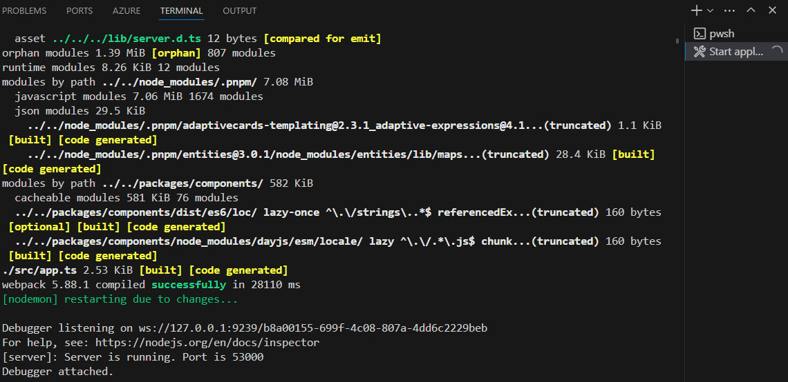
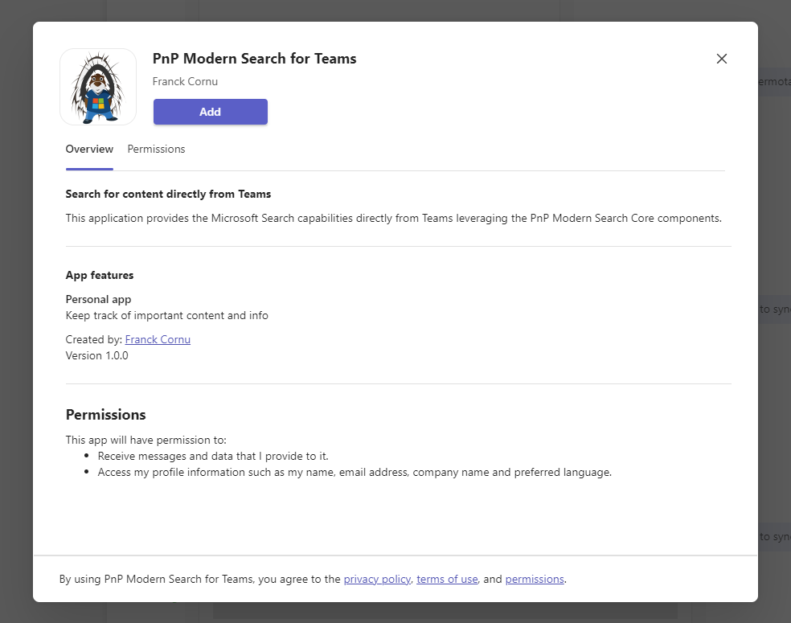

# Getting started

## Prerequisites

- [Visual Studio Code](https://code.visualstudio.com/) with the following recommended extensions installed:
    - [Bicep](https://marketplace.visualstudio.com/items?itemName=ms-azuretools.vscode-bicep)
    - [ESLint](https://marketplace.visualstudio.com/items?itemName=dbaeumer.vscode-eslint)
    - [Tailwind CSS IntelliSense](https://marketplace.visualstudio.com/items?itemName=bradlc.vscode-tailwindcss)
    - [PowerShell](https://marketplace.visualstudio.com/items?itemName=ms-vscode.PowerShell)
    - [Teams Toolkit](https://marketplace.visualstudio.com/items?itemName=TeamsDevApp.ms-teams-vscode-extension)
- Node.js v16.19.1 or higher
- TeamsFx CLI v2.0.1 (`npm i -g @microsoft/teamsfx@2.0.1`)

## Build the solution locally

:::info
In local mode, the Entra application is created and configured automatically according to the `template/aad.manifest.template.json` file and provisioning steps in `teamsapp.local.yml`. For more information refer to the [TeamsFx documentation](https://learn.microsoft.com/en-us/microsoftteams/platform/toolkit/use-existing-aad-app). 
:::

1. In the `env/env.local` file, add the following values:

```
TEAMSFX_ENV=local
APP_NAME_SUFFIX=local

TAB_DOMAIN=localhost:53000
TAB_ENDPOINT=https://localhost:53000

AAD_APP_NAME=PnP Modern Search Components - DEV // Name on the application for local testing. This will be created and configured automatically by TeamsFx
WEB_APP_SKU=F1 // = Free Tier
```

2. In the `.env` file at the root of the project, complete the following information:

```
ENV_MSSearchAppClientId=<ID of the Entra app used for local testing> // You need to deploy once at least to get this ID
ENV_MSSearchAppScopes=["ExternalItem.Read.All","Files.Read.All","Sites.Read.All","Bookmark.Read.All","Acronym.Read.All","QnA.Read.All"]
```

:::::warning
This values are used to populate values in the `apps.ts` files when bundling the application through Webpack. **They are not used by TeamsFx**

:::note Client
_webpack/app/webpack.common.js_

```json
plugins: [  
    ...
    new webpack.EnvironmentPlugin(['ENV_MSSearchAppClientId', 'ENV_MSSearchAppScopes'])
    ...
]
```

_app.ts_

```typescript
...
const graphScopes = JSON.parse(process.env.ENV_MSSearchAppScopes);
const clientId = process.env.ENV_MSSearchAppClientId;
...  
```
:::

:::::

3. Run application by pressing F5 in Visual Studio Code. The Teams Toolkit will build the application a launch browser to add the Teams app:

<div className='center' style={{flexDirection: 'column'}}>   
    

    
</div> 

:::note
- The Visual Studio debugger will be automatically attached to the Node.js process running the application.

- The local server process is running in watch mode, meaning you can update content in `src` folder and see results live in the Teams application (manual tab refresh is necessary).

- If you need to work on the web components at the same time (i.e. code in `packages/components`), you can run `pnpm run build:watch` from the latter to build the components in watch mode. In this case, any modification made on components will trigger a new compilation on the Teams application.

- If the server application is stopped for whatever reason, you can still restart it by running `pnpm run serve` from the `apps/teams` folder. You don't need to close the Teams application and press F5 again.
:::

### Deploy to Azure

To deploy the application to Azure, create a new TeamsFx environment and use [TeamsFx](https://www.npmjs.com/package/@microsoft/teamsfx-cli) CLI to provision resources:

```powershell
teamsfx account login azure --service-principal --username <service_principal_app_id> --password <service_principal_app_secret> --tenant <tenant_id>

teamsfx provision --env <env_name> --verbose

teamsfx deploy --env<env_name>

```

:::info
By default, the Entra app is not created in the `teamsapp.yml` so you have to create it manually.

You also need a Microsoft 365 account to register the app in the teams developer portal (more info [here](https://learn.microsoft.com/en-us/microsoftteams/platform/toolkit/use-cicd-template)). Define the following environment variables taht will be used by `teamsapp.yml` file:

```powershell
$env:M365_TENANT_ID=<tenant_id>
$env:M365_ACCOUNT_NAME=<account_name>
$env:M365_ACCOUNT_PASSWORD=<account_password>
```

**This account must have MFA deactivated and can be any valid Microsoft 365 account, even in a different Microsoft 365 tenant**.
:::

## Development notes

> TeamsFx version issues
    The solution uses "@microsoft/teamsfx": "2.3.0" because of a bug introduced in the `2.3.1` version. Behind the scenes, it uses a new major version of the "@azure/msal-browser" package causing conflicts with Teams and failing the SSO authentication.

> Webpack over tsc for Azure deployment

    We use Webpack both server and client side to package Javascript code. For the server, it replaces the default tsc compilcation approach and /lib folder. The main reason is because of the monorepo structure used by the solution and `pnpm` dependencies structure. When deploying to Azure or any other host and using a classic approach, the server application expects all modules to be available in a `node_modules` folder uploaded along the server files.  Because pnpm uses symlinks to a root `node_modules` of the solution and does not "flatten" all modules, using this approach is likely impossible as modules are not resovled correctly. The solution is to bundle all dependencies into a single Javascript bundle and upload all necessary resources from a `dist` folder.

> Azure deployment with Express.js and HTTPS

    When deploying to Azure, you need to tell the server to not use SLL. This part is actually handled by Azure directly. However, serving locally, the server needs to use a local self-signed certificate. That is why we use the env value `RUNNING_ON_AZURE` to dynamically determine the behavior in the `server.ts` file.