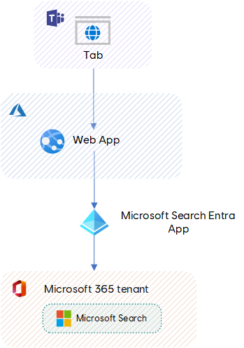

# Solution overview

## Architecture

## Technologies 

The solution uses the following technologies

| Solution part | Technology/Tool | Comments |
| ------------- | --------------- | -------- |
| **Node.js server** | [Express.js](https://expressjs.com/) | Used instead of the default Restify. Works better for Webpack bundling. 
| **Bundling (server/client)** | [Webpack 5](https://webpack.js.org/) | Same version as the web components project.
| **Styles** | [TailwindCSS](https://tailwindcss.com/) | Use the same configuration as the web components project.
| **Hosting** | [Azure Web App](https://azure.microsoft.com/fr-ca/products/app-service/web) | Azure web app service.