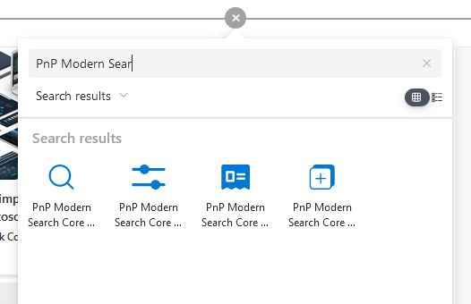

# Add Web Parts to your site

To add them on a SharePoint page, edit the page page and search for _"PnP Modern Search Core"_: 

 
    

:::note
SharePoint Web Parts are meant for end-users to integrate them in their SharePoint pages.
:::

:::note
⚠️**PnP Modern Search Core Components Web Parts** are different from **[PnP Modern Search](https://microsoft-search.github.io/pnp-modern-search/)** regular Web Parts