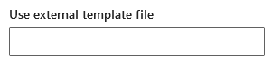
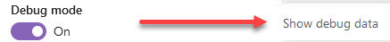

import CodeBlock from '@theme/CodeBlock';
import Admonition from '@theme/Admonition';

# Authoring templates

Because [web components](../../web-components/available-components) behind all the Web Parts are directly derived from the [Microsoft Graph Toolkit](https://learn.microsoft.com/en-us/graph/toolkit/overview?tabs=html), they use the same [templating capability](https://learn.microsoft.com/en-us/graph/toolkit/customize-components/templates). 
Therefore, you can do pretty much the same customizations as any toolkit component following the official documentation guidelines.

:::warning
Unlike the PnP Modern Search solution, templates **are no more based on [Handlebars](https://handlebarsjs.com/)**. It uses Microsoft Graph Toolkit template capability with plain Javascript.
::: 

## Templates in Web Parts

When customizing a template, you actually override **a part** of the underlying web component UI, **not the entire experience** (for web components, this concept is called **[slots](https://developer.mozilla.org/en-US/docs/Web/API/Web_components/Using_templates_and_slots)**).
The parts you can change depend on each component (i.e. Web Part) and what templates it exposes. 
Refer to individal Web Parts documentation to see the list of templates provided.

:::tip
Template = predefined part of the UI you can override in the component
:::

In the second configuration page of their property pane, most of the Web Parts propose multiple options:

<div className='center'>
    
</div>

The two base options are always available:

- ➝ **Default** is the native experience for the component (i.e no templates provided).
- ➝ **Custom** is where you can override templates for underyling components

Some Web Parts may provide more options (like 'Tiles' in the search resulst Web Part), but they are actually **'Custom'** templates where templates have been overriden.

## Custom templates

To override templates for a specific Web Part click on the **Edit component template(s)** text box to open the editing canvas:

<div className='center' style={{flexDirection: 'column'}}>   

    

    
</div>

The `data-type` attribute corresponds to the name of the template exposed by the component.

:::info
➝ You can define multiple templates at the same time. \
➝ Available templates depend of the Web Part (ex: [Search Results](./search-results#customize-templates), [Search Filters](./search-filters#customize-templates), [Search Verticals](./search-verticals#customize-templates)).
:::

### Available customizations

export const styleTagSnippet = `<template data-type="items">
    <style>
        .red {
            color: red;
        }
    </style>

    <div class="red">My text is red</div>
</template>
`;

export const databindingSnippet = `<template data-type="items">
    <div>Total count is: {{totalCount}}</div>
</template>
`;

export const loopSnippet = `<template data-type="items">
    <div data-for="item in items">
        <div>Title: {{ item.title }}</div>
    </div>
</template>
`;

export const customWebComponentsSnippet = `<template data-type="items">
    <div data-for="item in items">

        <!-- PnP Modern Search Core component -->
        <pnp-adaptive-card 
            url="<url_of_the_adaptive_card>" 
            context="{{ mergeContext(item) }}">
        </pnp-adaptive-card>
    </div>

    <!-- MGT component -->
    <mgt-file-list></mgt-file-list>
</template>
`;

export const conditionalRenderingSnippet = `<template data-type="filter-value">
    <div data-if="filterName === 'FileType'">
        {{ name.toUpperCase() }}
    </div>
    <div data-else>
        {{ name }}
    </div>
</template>`;

export const dataHtmlSnippet = `<template data-type="items">
    <div data-for="item in items">
        <div>Title: {{ item.title }}</div>
        <div data-html>Summary: {{ item.summary }}</div>
    </div>
</template>
`;

Here are the possible customizations you can make in templates:

| Customization                                     |         | Example |
|---------------------------------------------------|---------| --------|        
| Define you own web component templates            | ❌(defined by the internal components) |
| Add `<style>` tags                                | ✔️| <CodeBlock language="html">{styleTagSnippet}</CodeBlock> <Admonition type="warning">CSS classes are global to the page. Make sure you use unique names to avoid conflicts.</Admonition>
| Add `<script>` tags                               | ❌(for security reasons)
| Use data binding                                  | ✔️(using `{{ }}`) | <CodeBlock language="html">{databindingSnippet}</CodeBlock>
| Change binding syntax                             | ❌(default is awlays `{{ }}`)
| [Use conditional rendering](https://learn.microsoft.com/en-us/graph/toolkit/customize-components/templates#conditional-rendering) | ✔️ | <CodeBlock language="html">{conditionalRenderingSnippet}</CodeBlock>
| [Use loops](https://learn.microsoft.com/en-us/graph/toolkit/customize-components/templates#looping) | ✔️ |  <CodeBlock language="html">{loopSnippet}</CodeBlock>
| Use [`{{this}}`](https://learn.microsoft.com/en-us/graph/toolkit/customize-components/templates#this) | ✔️ | 
| Use [data context helper properties](https://learn.microsoft.com/en-us/graph/toolkit/customize-components/templates#data-context-helper-properties) | ✔️ | 
| Use custom web components | ✔️Only components starting with `pnp-` or `mgt-`  | <CodeBlock language="html">{customWebComponentsSnippet}</CodeBlock>
| Convert text from properties to HTML              | ✔️ (using `data-html` attribute). | <CodeBlock language="html">{dataHtmlSnippet}</CodeBlock> ➝ Without `data-html` <br/><br/> <div style={{width: 513}}></div> <br/> ➝ With `data-html` <br/><br/><div style={{width: 513}}></div>

### Use an external file

Instead of defining the HTML code directly embbeded in the Web Part, you can link an external **.html** file.

<div className='center'>
    
</div>

:::warning
The file needs to be accessible in read by users. If you store the file in a SharePoint library, make sure permissions are set correctly.
:::

### Enable debug mode

The debug mode allows to inspect underlying data returned by the Web Part. It is also useful to see available properties you can use in your templates.

<div className='center' style={{flexDirection: 'column'}}>   
    

    
</div>

### Enable Microsoft Graph toolkit

<div className='center' style={{flexDirection: 'column'}}>   
    

    <div style={{display: 'flex'}}>

        <div style={{width: '70%', marginRight: 30}}>   
            ```html
            <template data-type="items">
                <mgt-file-list></mgt-file-list>
            </template>
            ```
        </div>

        <div style={{width: '30%', justifyContent: 'center', alignItems: 'center', display: 'flex'}}>
            
        </div>
    </div>
</div>

:::info
When Microsoft Graph Toolkit is enabled, you don't need to add a [provider](https://learn.microsoft.com/en-us/graph/toolkit/providers/providers) as the authentication is managed automatically by the Web Part. 
:::

:::warning
Use toolkit component with caution especially when used in loops as performances could significantly decrease. 
:::

## Advanced concepts

### Use adaptive cards in templates

It is possible to use. However, because adaptive cards rely have their own templating mechanism based on a data context to display the information, you need to use the special helper `mergeContext` to pass the Web Part context to the adaptive card.

:::info
The `mergeContext` helper mergers the item data and Web Part context (slots, layout properties) into a single JSON object so it can be used in adaptive cards.
:::

➝ <span style={{textDecoration: 'underline'}}>Example</span>

**Adaptive card**

```json
{
    "$schema": "http://adaptivecards.io/schemas/adaptive-card.json",
    "type": "AdaptiveCard",
    "version": "1.3",
    "body": [
        {
            "type": "Container",
            "items": [
                {
                    "type": "TextBlock",
                    "text": "${title}" // 'title' from item.title property in the search result
                }
            ]
        }
    ]
}
```

**Usage in templates**

```html
<pnp-adaptive-card url="<url_of_the_adaptive_card>" context="{{ mergeContext(item) }}">
</pnp-adaptive-card>
```