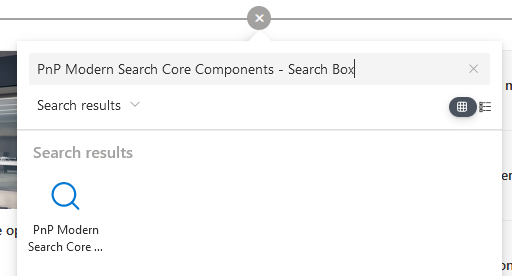
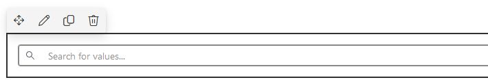
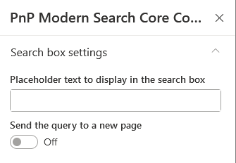
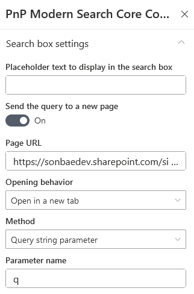

# Search Box

## Basic configuration

1. Edit the page and add a '_PnP Modern Search Core Components - Search Box'_. 

    
   
   
        

        
    

2. Specify a placeholder

    
   
        
    

    :::warning
    Placeholder doesn't support translations.
    :::

3. Connect the other web parts on page:
    - ➝ [**Connect to a search results**](./search-results#query-text)

## Send query to a new page 

Instead of using the search box value in the same page, you also have the possibility to send the entered keywords to an other page (SharePoint page or not).

    
   
        
    

1. **Send the query to a new page** ➝ configure following options:

    - **Page URL**: the URL of the page to redirect to.
    - **Opening behavior**: use teh current tab or use a new tab
    - **Method**: the way the search box value is passed to other page.
        - By _URL fragment_: in this case, the value with be sent like _https://mypage_**#searchbox_value**.
        - By _Query string parameter_: in this case, the value with be sent like _https:/mypage_**?myParam=searchbox_value** where `myParam` is a arbitrary value you can define in the settings.

     
    :::info Configure target page to use the search box value
    The value can be used in target page, in a search results web part by configuring [a dynamic query text](./search-results#query-text).
    ::: 
  

