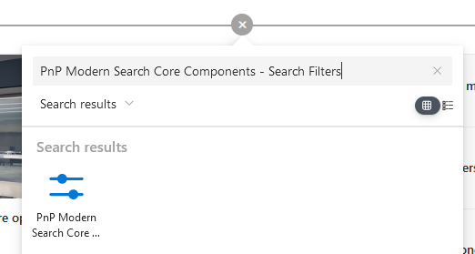
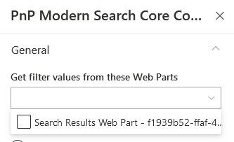
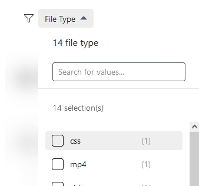
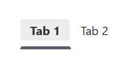

import Admonition from '@theme/Admonition';
import Tabs from '@theme/Tabs';
import TabItem from '@theme/TabItem';

# Search Filters

The '_Search Filters_' Web Part allows to filter the results displayed in a connected '_Search Results_' Web Part.

## Connection with search results

:::note Two-ways connection
Connection between search filters and search results is always a **two-ways** connection meaning both web parts need to be configured.
:::

1. Edit the page and add a ['_PnP Modern Search Core Components - Search Results_'](./search-results) and a _'PnP Modern Search Core Components - Search Filters'_ web parts.

    <div className='center' style={{flexDirection: 'column'}}>
        

        
    </div>

3. **In the filters web part**
    - In the property pane settings ➝ **Get filter values from these Web Parts** ➝ Select the search results web part to filter:

    <div className='center'> 
        
    </div>

    :::info Multiple connected search results
    You can connect multiple search results web parts to a single search filters one. In this case, filter values results and counts coming from connected search results **having the same field name** will be merged together. Other fields will be displayed as separate entries in the filters bar. <br/><br/> <span style={{textDecoration: 'underline'}}>Example:</span> <br/><br/><p>_Search results **WebPart1** and **WebPart2** expose respectively a _'FileType'_ filter with values and counts `value1 (1)`,`value2 (1)` for **WebPart1** and `value2 (1)`, `value3 (1)` for **WebPart2** and both are connected to the filters Web Part. In this case, a single _'FileType'_ filter name will be displayed (because the filter name is the same) with values `value1 (1)`,`value2 (2)`,`value3 (1)`. If you select a value that is not present in a search results (ex: `value1` for search results **WebPart2**), you will simply get zero result._</p>  
    :::

    - Choose operator to use between filters (**AND/OR**). **'OR'** by default.

    <div className='center'> 
        
    </div>

    - In the _"Filters settings"_ section ➝ [add/update/remove the filters](#configure-filters):

    <div className='center'> 
        
    </div>

    :::tip
    You can change filters order in the filters bar using drag n' drop in the property pane.
    :::

4. **In the search results web part**

    - In the property pane settings ➝ enable **Use filters/sort** option.
    - Then **Get filters configuration from this Web Part** ➝ Select the search filters web part to connect:

<div className='center'> 
    
</div>

## Configure filters {#configure-filters}

<Tabs>
    <TabItem value="basic_settings" label="Basic settings" default>

        Configure the basic options for a specific filter.

        <div style={{display: 'flex'}}>

            <div style={{width: '70%', marginRight: 30}}>   

            | **Setting** | **Description** |
            |------------|-----------------|
            | **Filter Name** | The field name from the search schema (ex: `RefinableStringXXX`) <br/><br/> <Admonition type="warning">For a field to be used as filter, it has be [**Refinable**](https://learn.microsoft.com/en-us/microsoftsearch/manage-search-schema#refinable) in the search schema.</Admonition> | 
            | **Display name** | The name of the filter to display for users. You can specify a value per language according to your site language settings. <br/><br/> <Admonition type="info">If your site is configured to use multiple languages, the '**Add new translation**' button will be available. Otherwise, the default language is used by default and the button is greyed out.</Admonition>    
            | **Template** | The template to use to display filter values. The builtin templates are: <ul><li>**Check box** ➝ use it for `Text` properties (ex: `RefinableStringXXX`) <p align="center" class="w-96"></p></li><li>**Date range** ➝ use it for `Datetime` properties (ex: `RefinableDateXXX`) <p align="center" class="w-96"></p></li></ul>
            | **Show count** | If applicable for the selected template, display counts for each filter values.
            | **Operator** | If multi values is selected, the operator to use between values (OR/AND).
            | **Mutli values** | If applicable for the selected template, allow selection of multiple values.
            | **Sort by** | Sort values by name or by count.
            | **Sort direction** | Sort values in ascending/descending order.
            | **Number of values** | The maximum number of values to be retrieved and display for a given filter. This value is useful if you use SharePoint refiners with a lot of refiner values. Default is `50`, maximum is `10000`. To get all refiner values, you must specify an higher number manually. **May have an impact on performances**.
            </div>

            <div style={{width: '30%', justifyContent: 'center', alignItems: 'flex-start', display: 'flex'}}>   
                
            </div>

        </div>

    </TabItem>
    <TabItem value="aggregations" label="Aggregations">

        Aggregations are useful to group multiple filter values to an unique one with a predefined value for instance aggregate multiple file extensions to a single file type family (Ex: Word documents).

        <div style={{display: 'flex'}}>

            <div style={{width: '70%', marginRight: 30}}>   
            | **Setting** | **Description** |
            |------------|-----------------|
            | **Aggregations** | Name of the aggregation as seen by users. You can specify a value per language according to your site language settings. <br/><br/> <Admonition type="info">If your site is configured to use multiple languages, the '**Add new translation**' button will be available. Otherwise, the default language is used by default and the button is greyed out.</Admonition> | 
            | **Matching values** | The matching filter values to aggregate. You can use either a plain text value for an exact match ex `docx`,`doc` or a regular expression. <br/><br/> <Admonition title="Regular expression format" type="info">For regular expression use the format `/your_expression/`. Ex `/^Parent:+$/` expression matches filter values beginning with the string `Parent:`. <br/><br/>  </Admonition> 
            | **Aggregation value** | The filter value to use when selected. You can use [KQL](https://learn.microsoft.com/en-us/sharepoint/dev/general-development/keyword-query-language-kql-syntax-reference) (ex: `docx OR FileType:doc`) or [FQL](https://learn.microsoft.com/en-us/sharepoint/dev/general-development/fast-query-language-fql-syntax-reference) (ex: `or("docx","doc")` ) expressions here. <br/><br/> <Admonition type="note">Using KQL or FQL the filter condition always starts with `PropertyName:<condition_value>`. </Admonition>
            | **Icon Url** | Optional icon URL to display near the aggregation name.
            </div>

            <div style={{width: '30%', justifyContent: 'center', alignItems: 'flex-start', display: 'flex'}}>   
                
            </div>

        </div>

    </TabItem>

</Tabs>

## Control filter visibility with search verticals {#configure-verticals}

Connection with search verticals allows you to configure visibility **for each individual filters**. This allows to have only one search filters web part on the page connected to multiple search results web parts.

1. Edit the page and add a '_PnP Modern Search Core Components - Search Verticals'_. Configure some verticals.

    <div className='center'>   
        
    </div>

3. In the filters web part ➝ enable **Use verticals** option. 
4. Then **Search verticals component to connect to** ➝ select search verticals web part to connect.

:::tip Find Web Part instance ID
To find the Web Part instance ID ➝ [here](./tips#tip-instanceid)
:::

5. For each individual filter, a new configuration tab **'Display'** is available. Select the tab where the current filter should be displayed:
    
    <div className='center'>   
        
    </div>

:::warning
If you worked with the PnP Modern Search in the past, the search verticals behavior is different here. In PnP Modern Search, connected search verticals controls the visiblity of the **entire web part**. In this web part, visibility is controlled **per filter**.
:::

## Customize templates

:::info Working with templates
To know how to author templates, refer to [the general guidelines](./customize-templates).
:::

The search filters web part provides the following templates to be overriden:

### `filter-name`

This template controls the rendering of the filter name:

➝ Applies to filter templates: **Checkbox**, **Date**

<span style={{textDecoration: 'underline'}}>**Properties**</span>
<br/>
The following properties can be used in the template:

| Property | Description |
|----------|-------------|
| `name`   | The filter display name (localized).
| `filterName` | The filter field name. 
| `submittedValues` | Array of submitted values.

<div style={{display: 'flex'}}>

    <div style={{width: '70%', marginRight: 30}}>   
        ```html
        <template data-type="filter-name">
            {{ name.toUpperCase() }}
        </template>
        ```
    </div>

    <div style={{justifyContent: 'center', alignItems: 'center', display: 'flex'}}>
        
    </div>
    
</div>

### `filter-value`

This template controls the rendering of each individual filter values.

➝ Applies to filter templates: **Checkbox**, **Date**

<span style={{textDecoration: 'underline'}}>**Properties**</span>
<br/>
The following properties can be used in the template:

| Property | Description |
|----------|-------------|
| `key`    | An unique identifier for that filter value.
| `name`   | The filter value display name.
| `value`  | Internal value to use when the value is selected.
| `operator`  | The comparison operator to use with this value.
| `value`  | Internal value to use when the value is selected
| `count`  | The number of results with this value.
| `keywords`  | The current search keywords associated to the search.
| `filterName` | The filter field name where the value belongs. 

<div style={{display: 'flex'}}>

    <div style={{width: '70%', marginRight: 30}}>   
        ```html
        <template data-type="filter-value">

            <div data-highlight="" data-if="filterName === 'FileType'">
                {{ name.toUpperCase() }}
            </div>
            <div data-else="">
                {{ name }}
            </div>
            
        </template>
        ```
    </div>

    <div style={{width: '30%', justifyContent: 'center', alignItems: 'center', display: 'flex'}}>
        
    </div>
    
</div>

:::tip
You can apply a template conditionally to a filter name using `data-if="filterName === 'FileType'"`. Use the **debug mode** to inspect variables that can be used in your templates.
:::