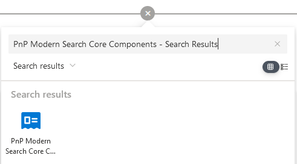
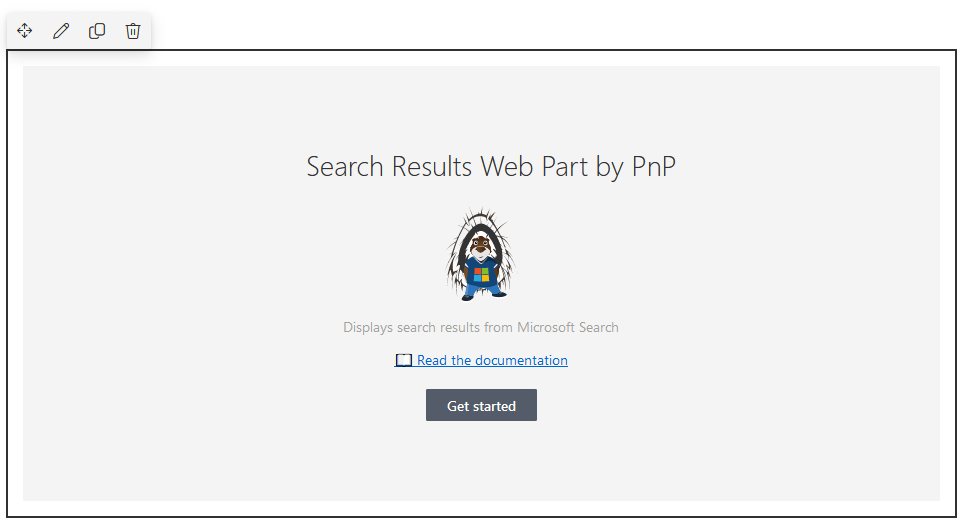
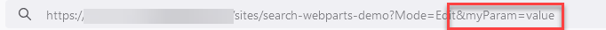
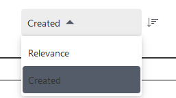
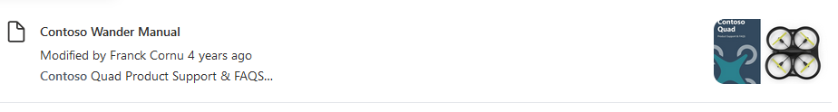

import Tabs from '@theme/Tabs';
import TabItem from '@theme/TabItem';
import Admonition from '@theme/Admonition';

# Search Results

The 'Search Results' Web Part is the fundamental building block of whole global solution. Its purpose is basically to get data from a search index and render them in a specific default or custom layout.

This Web Part can be used **alone** or connected to **other Web Parts** to add dynamic interactions (filters, search box or verticals). To use the Web Part on a SharePoint page:


1. Edit your SharePoint modern page.
2. Search for the 'PnP Modern Search Core - Search Results' Web Part and add it to your page:

<div className='center' style={{flexDirection: 'column'}}>   
    

    
</div> 

## Configure the search query {#query-settings}

### Basic mode

The basic mode allows you to quickly get started and configure your query without having a deep knowledge of search concepts.

:::note

🚧 Basic mode is still under development and will be available soon 🚧 

:::

### Advanced mode

The advanced mode allows you to fine tune the query settings. However, it requires a **minimum knowledge about Microsoft Search concepts** as most of the parameters are a wrapper over the [Microsoft Search Graph API](https://learn.microsoft.com/en-us/graph/search-concept-overview). 

#### Entity types {#entity-types}

Entity types represent the type of data you want to retrieve. The following entity types are available:

<div style={{display: 'flex'}}>
    <div style={{width: '50%'}}>   
        | Entity type | Description
        | ----------- | -----------
        | **List Items** | Used to retreive SharePoint list items. Note that files and folders are also returned as list items.
        | **List** | Search for lists. Note that document libraries are also returned as lists.
        | **Drive** | Document libraries.
        | **Drive Items** |  Files, folders, pages, and news.
        | **Sites** | Sites in SharePoint.
        | **External Items** | External indexed sources (ex: `Profiles`, `Ubipedia`, `DXP`). When selecting this option, you must specify a valid connection ID (see below 👇).
        | **Teams messages** | Messages fron Microsoft Teams.
        | **Bookmarks** | Microsoft Search bookmarks defined at organization level.
        | **Acronyms** | Microsoft Search acronyms defined at organization level.
        | **Messages** | Email messages from Outlook.
        | **Events** | Calendar events from Outlook.
    </div>

    <div style={{width: '50%', justifyContent: 'center', alignItems: 'center', display: 'flex'}}>   
        
    </div>
</div>


:::warning

Not all entity types can be used together. Refer to the following table to see [possible combinations](https://learn.microsoft.com/en-us/graph/api/resources/search-api-overview?view=graph-rest-1.0#known-limitations). The Web Part will automatically prevent incompatile combinations as long as you choose options.

:::

#### Query text

The query text typically represents the free text keywords to search for. Its value can be static or dynamic based on a dynamic value (ex: a search box on the page, a query string parameter, etc.).

<div className='center'>   
    
</div>

**Static value**

Enter a value that will apply every time for the query. You can also use [Keyword Query Language](https://learn.microsoft.com/en-us/sharepoint/dev/general-development/keyword-query-language-kql-syntax-reference) as well. 

**Dynamic value**

Use a dynamic value if the search keywords should come from an other source on the page.

:::note
Theorically, all SharePoint web parts or extensions defined as a source on the page will be listed here. Any `string` value from a source can be used as query text.
:::

<Tabs>
  <TabItem value="searchbox" label="Example: Connect to a search box" default>
    You can connect the _PnP Modern Search Core - Search Box_ as query text source for the search results Web Part. To do so:

    1. Add the '_PnP Modern Search Core - Search Box_' on the same page.
    2. Open the '_PnP Modern Search Core - Search Results_' property pane settings.
    3. In **Query Text** ➝ **Dynamic Value** ➝ **Connect to source**, choose _PnP Modern Search Core - Search Box_.
    4. In **PnP Modern Search Core - Search Box's properties** choose your Search Box WebPart. 

    <div className='center'> 
        
    </div>
:::tip Find Web Part instance ID
To find the Web Part instance ID ➝ [here](./tips#tip-instanceid)
:::  
    
  </TabItem>
  <TabItem value="querystring" label="Example: Use a query string parameter">
    1. Add the query parameter with some value directly in the URL
 
    <div className='center'> 
        
    </div>

    2. Open the 'PnP Modern Search Core - Search Results' property pane settings.
    3. In **Query Text** ➝ **Dynamic Value** ➝ **Connect to source**, choose _Page environment_.
    4. In **Page environment's properties** choose your **Query string** ➝ **Query parameters** ➝ &lt;your_param_name&gt; 
    
    <div className='center'> 
        
    </div>

:::info

If you don't reload the page with you query string parameter, you won't see your parameter in the list.

:::

  </TabItem>
</Tabs>

**➔ Use a default value**

When connecting to dynamic source, you can also set a default value. This option is useful when no keywords are specified by default (ex: an empty search box)

<div className='center'> 
    
</div>

#### Query template

The search query template to use. It allows you to use dynamic tokens according to the context or specify conditions that should always apply to the query.  You can also use [Keyword Query Language](https://learn.microsoft.com/en-us/sharepoint/dev/general-development/keyword-query-language-kql-syntax-reference) as well here. 

<div className='center'> 
    
</div>

:::info Working with tokens
To see the list of allowed tokens please refer to this [page](./working-with-tokens).
:::

## Advanced settings {#advanced-settings}

### Selected fields

The selected fields represent the field values that should be included in the search response. Then, these values can be used in results, eiher to be displayed (ex: display the result title or created date for each result item) or for computing purpose (ex: build an URL with an ID).

- To add a new field, enter the name in the textbox box ➝ press "Enter".
- To remove a field, open the list ➝ de-select the field from the list.

<div className='center'> 
    
</div>

:::info

With Microsoft Search, fields depends on the entity types you query. For instance, with `listItem`, `sites` and `driveItem`, you can retrieve [SharePoint managed properties](https://learn.microsoft.com/en-us/sharepoint/manage-search-schema) but also **some** properties specific to the `driveItem` underlying Microsoft Graph resource type (ex: `lastModifiedBy`).
Refer to the [Microsoft Graph API reference](https://learn.microsoft.com/en-us/graph/api/overview?view=graph-rest-1.0) to see all available properties per entity types (complex properties like relationships can't be retrieved this way however).

**Fields you can retrieve per entity types:**

| Entity type | From search schema | From Graph resource type |
|-------------|--------------------------------------|--------------------------------|
|**Drive Items**|  ✔️ (SharePoint) | ✔️ [(Link)](https://learn.microsoft.com/en-us/graph/api/resources/driveitem?view=graph-rest-1.0#properties)
|**List Items**| ✔️(SharePoint) | ❌
|**Sites**| ✔️(SharePoint) | ✔️ [(Link)](https://learn.microsoft.com/en-us/graph/api/resources/site?view=graph-rest-1.0#properties)
|**Lists**| ✔️ (SharePoint) | ✔️ [(Link)](https://learn.microsoft.com/en-us/graph/api/resources/list?view=graph-rest-1.0#properties)
|**Drives** | ✔️(SharePoint) | ✔️[(Link)](https://learn.microsoft.com/en-us/graph/api/resources/drive?view=graph-rest-1.0#properties)
|**Teams messages** | ❌ | ✔️ [(Link)](https://learn.microsoft.com/en-us/graph/api/resources/chatmessage?view=graph-rest-1.0#properties)
|**Bookmarks** | ❌ | ✔️ [(Link)](https://learn.microsoft.com/en-us/graph/api/resources/search-bookmark?view=graph-rest-beta#properties)
|**Acronyms** | ❌ | ✔️ [(Link)](https://learn.microsoft.com/en-us/graph/api/resources/search-acronym?view=graph-rest-beta#properties)
|**Messages** | ❌ | ✔️[(Link)](https://learn.microsoft.com/en-us/graph/api/resources/message?view=graph-rest-1.0#properties)
|**Events**| ❌ | ✔️[(Link)](https://learn.microsoft.com/en-us/graph/api/resources/message?view=graph-rest-1.0#properties)
|**External Items** | ✔️(Specific to source) | ❌

:::

:::warning
Specify only fields you need. More you add fields in the response, more the results will be slow to appear.
:::

### Configure filters and sorting

#### Filters

See the _'Search filters'_ [documentation](./search-filters) for the configuration process.

#### Sorting

The sort options are managed in the Search Results web part but requires a connected search filters filters to be displayed


<div style={{display: 'flex'}}>

    <div style={{width: '70%', marginRight: 30}}>   

    | **Setting** | **Description** |
    |------------|-----------------|
    | **Sort field** | The sort field name to use. The field needs to be **sortable/refinable** in the search schema. <br/><br/> <Admonition type="warning">There is not more **'Sortable'** attribute with Microsoft Search. A property is sortable as long it is **Refinable** in the search schema.</Admonition>   
    | **Sort direction** | The sort direction to use **by default** (ascending/descending).
    | **Is default sort** | Indicates if the sort is applied by defaut in the query. If the sort field/direction is not 
    | **Is user sort** | Indicates if the sort can be set by users manually. <br/><br/> <Admonition type="info">➝ Sort fields are displayed in the connected search filters (right position, cannot be changed). <br/><br/>➝ When default sort and user sort options are both enabled, items are sorted by default as long user do not modify the sort field/direction manually.<br/><br/> ➝ The **Relevance** sort field is the same as if no sort was selected. <br/><br/> </Admonition>
    | **Display name** | If user sort is enabled, the name of the field as seen by users in **the search filters web part**. 

    </div>

    <div style={{width: '30%', justifyContent: 'center', alignItems: 'flex-start', display: 'flex'}}>   
        
    </div>

</div>


### Working with result types

Result types are [JSON adaptive cards managed centrally from the Microsoft Search admin portal](https://learn.microsoft.com/en-us/microsoftsearch/manage-result-types) and are defined **per source**. It allows to streamline the UI experience across all search locations.
Enable this option only if you want to rely on the managed experience instead of the web part builtin templates.

<div className='center'> 
    
</div>


:::info

In the PnP Modern Search Core environment, only the following sources use result types:

- **Profiles**
- **Ubipedia**
- **ServiceNow Knowledge Base**
- **Wordpress DXP**

**Ex: Ubipedia** 

➝ without result types enabled

<div className='center'> 
    
</div>

➝ with resulty types enabled

<div className='center'> 
    
</div>

:::

:::warning Don't forget to define fields!
Most of the time, result types expect specific fields to be included in the search response to work properly. If you are not sure what fields to use, contact an admin.
::: 

### Use beta endpoint

The beta option switches the underlying Microsoft Search Graph API endpoint from [`v1.0`](https://learn.microsoft.com/en-us/graph/api/overview?view=graph-rest-1.0&preserve-view=true) to [`beta`](https://learn.microsoft.com/en-us/graph/api/overview?view=graph-rest-beta&preserve-view=true).  

<div className='center'> 
    
</div>

:::danger Not for production

The `beta` endpoint is not suitable for production usage and it is not supported by our team nor by Microsoft. It should be used only for test/development purposes.

:::

### Query modifications

If enabled, the user gets the search results for the corrected query if there were no results for the original query with typos. **It means the query will be automatically modified**.

<div className='center'> 
    
</div>

:::warning
🚧 As of today, there is no way for user to see if the query has been moddified or not in the UI when results are displayed. 🚧
:::

## Paging settings

The paging options are available for all data sources.

<div className='center'>
    
</div>

| Setting | Description |
| --------| ----------- |
|**Show paging** | Hide or display the paging control.
|**Page size** | The size of the page to be retrieved. The maximum value is **500**.
|**Number of pages to show** | Determines the number of pages to display in range. Minimum **1** to **20**. If your request returns more than 2000 pages, you'll see a "Too many pages" message. This is to avoid any empty pages due a Microsoft Search API limitation.

:::warning
We recommend to limit the number of items per page betwen 10 and 20 to manage performances. 
:::

## Pre-built templates

The search results provides pre-built templates you can use to display results.

### Default (List)

By default, items are rendered in list format. 

<span style={{textDecoration: 'underline'}}>Example: news item</span>

<div className='center'>   
    
</div>

<span style={{textDecoration: 'underline'}}>Example: PDF file</span>

<div className='center'>   
    
</div>

:::info
Icons and properties are automatically displayed according to [entity type](#entity-types).
:::

### Tiles

The tiles template displays items in cards. Example with Anvil SharePoint site:

<div className='center'>   
    
</div>

The following options are available:

⚙️ **Control the number of cards displayed according to Web Part width**

To make sure the dsiplay is responsive, you can control the number of cards dispkayed according to the Web Part container width, for instance if the page is displayed from a mobile.

1. ➝ Select the width breakpoint:

<div className='center'>   
    
</div>

2. ➝ Select the number of cards to display for this width:

<div className='center'>   
    
</div>

:::warning
Breakpoints are **relative to the Web Part container width**, not the page width.
:::

### Generic options

#### Show count

The show count option display the total number of results returned by the query.

<div className='center' style={{display: 'flex'}}>   
    

    
</div>

#### Control Web Part visibility with search verticals {#configure-verticals}

You can connect the search results Web Part to a search verticals on the same page:

1. Add a _'PnP Modern Search Core - Search Verticals'_ Web Part on the page and [configure some tabs](./search-verticals#configure-verticals).

<div className='center'>   
    
</div>

2. Enable the **Use verticals** option ➝ Choose the verticals Web Part to connect to:

<div className='center'>   
    
</div>

:::tip Find Web Part instance ID
To find the Web Part instance ID ➝ [here](./tips#tip-instanceid)
:::  

3. Choose tabs where the search results Web Part should be displayed when selected.

<div className='center'>   
    
</div>

:::info
The verticals control the entire visiblity of the Web Part. When the vertical is not selected, nothing is rendered and no query is made.
:::

## Customize templates

:::info Working with templates
To know how to author templates, refer to [the general guidelines](./customize-templates).
:::

The search results web part provides the following templates to be overriden:

### `items`

This template controls the rendering of each results item:

<span style={{textDecoration: 'underline'}}>**Properties**</span>
<br/>
The following properties can be used in the template:

| Property | Description |
|----------|-------------|
| `items`   | Array of items returned by search results. For convenience, all properties are flatten automatically (ex: instead of `items.resource.fields.myProperty`, you can use directly `items.myProperty`). <br/><br/> <Admonition type="warning">Field properties are **case sensitive** (ex: `item.Path` is different from `item.path`)</Admonition>
| `totalCount` | The count of items returned. 
| `filters` | The available filters provided by the data source according to the filters configuration provided from the data context (if applicable).
| `resultTemplates` | Result templates available for items provided by the data source.
| `rawResponse` | The raw response payload received from the Microsoft Search Graph API.
| `rawRequest` | The raw request payload sent to Microsoft Search Graph API.

<div style={{display: 'flex'}}>

    <div style={{width: '70%', marginRight: 30}}>   
        ```html
        <template data-type="items">
            <div data-for='item in items'>
                <div>Title: {{ item.Title }}</div>
                <div>Path: {{ item.path }}</div>
            </div>
        </template>
        ```
    </div>

    <div style={{width: '30%', justifyContent: 'center', alignItems: 'center', display: 'flex'}}>
        
    </div>
    
</div>

### `shimmers`

This template controls the rendering of shimmers **before** results are fetched and displayed.

<span style={{textDecoration: 'underline'}}>**Properties**</span>
<br/>
The following properties can be used in the template:

| Property | Description |
|----------|-------------|
| `items`  | Array of **empty items** sized according the configured number of items per page.

<div style={{display: 'flex'}}>

    <div style={{width: '70%', marginRight: 30}}>   
        ```html
        <template data-type="shimmers">
            <div data-for="i in items">

                <div class="animate-shimmer pb-8">
                    <div class="flex space-x-2 mb-2">
                        <div class="w-6 h-6 rounded bg-slate-200"></div>
                        <div class="w-96 h-6 rounded bg-slate-200"></div>
                    </div>
                    <div class="flex space-x-2 mb-2">
                        <div class="w-16 h-3 rounded bg-slate-200"></div>
                        <div class="w-16 h-3 rounded bg-slate-200"></div>
                        <div class="w-16 h-3 rounded bg-slate-200"></div>
                    </div>
                    <div class="flex flex-col mb-4 space-y-2">
                        <div class="w-full h-3 rounded bg-slate-200"></div>
                        <div class="w-96 h-3 rounded bg-slate-200"></div>
                    </div>
                </div>

            </div>
        </template>
        ```
    </div>

    <div style={{width: '30%', justifyContent: 'center', alignItems: 'center', display: 'flex'}}>
        
    </div>
    
</div>

## Template slots

The search results web part provides some predefined slots for templates:

<div className='center'>
    
</div>

> **Slots** are placeholders defined on templates that can be mapped either to a **specific field retrieved from results** (ex: a value you specified in the [**Fields**](./search-results#selected-fields) option in the search results web part settings) or a **static value** (ex: an arbitrary URL). They are especially useful if you only need small updates, like changing the value of a specific field in the result visual without udpating the entire template.

:::warning
Slots from **Default** layout can't be removed (only modified, except the title). To define your own slots, you need to switch to the **Custom** layout.
::: 

<Tabs>
    <TabItem value="dynamic-value" label="Example: Use a dynamic field value" default>

        1. In the search results web part, configure the [query settings](./search-results#query-settings) to get at least **one result** (this step is important to lookup all available fields from the response).
        2. Enable **Use dynamic field value** option.
        3. In **Slot value** ➝ select a field from the list.

        <div className='center'>
            
        </div>
        
:::warning
If there are no results currently displayed, the fields list will be empty 
:::

    </TabItem>
    <TabItem value="static-value" label="Example: Use a static value">

        2. Disable **Use dynamic field value** option.
        3. In **Slot value** ➝ add your value.

        <div className='center'>
            
        </div>

:::info
[Tokens](./working-with-tokens) are nore supported in static slot value.
:::
    </TabItem>
</Tabs>

:::info Use slots in custom templates
In custom made templates slots can be referenced like this:

```html
<div>Title: {{ slot("Name of my slot",item) }}</div>
```
:::
