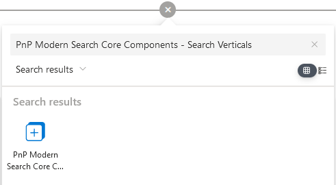

import Admonition from '@theme/Admonition';

# Search Verticals

The _'Search Verticals'_ Web Part allows to conditionally render a _'Search Results'_ Web Part according to the selected vertical and [control the visiblity of individual filters](./search-filters#configure-verticals). It is a simple way to build a complete search center including multiple sources.

## Configure verticals

1. Edit the page and add a '_PnP Modern Search Core - Search Verticals'_. 

    <div className='center' style={{flexDirection: 'column'}}>   
   
        

        
    </div>

2. Configure verticals

    <div style={{display: 'flex'}}>

        <div style={{width: '70%', marginRight: 30}}>   
        | **Setting** | **Description** |
        |------------|-----------------|
        | **Vertical name** | The name of the vertical as seen by users.You can specify a value per language according to your site language settings. <br/><br/> <Admonition type="info">If your site is configured to use multiple languages, the '**Add new translation**' button will be available. Otherwise, the default language is used by default and the button is greyed out.</Admonition>
        | **Vertical key** | The vertical key associated to the tab. Useful to get the vertical valyue via the [`{verticals.key}` token](./working-with-tokens#connections-tokens).
        | **Vertical value** | The vertical value associated to the tab. Useful to get the vertical value via the [`{verticals.key}` token](./working-with-tokens#connections-tokens).
        | **Is link** | If enabled, the vertical will behave as a hyperlink when cliked.
        | **Link url** | The URL to browse when clicked.
        | **Open behavior** | The link open behavior. <ul><li>**New tab**: open in a new tab of current browser.</li><li>**Self**: replace the current tab.</li></ul> 
        </div>

        <div style={{width: '30%', justifyContent: 'center', alignItems: 'flex-start', display: 'flex'}}>   
            
        </div>
            
    </div>

    :::info Tip
    You can change verticals order using drag n'drop in the property pane.
    :::

3. Connect the other web parts on page:
    - ➝ [**Connect to a search results**](./search-results)
    - ➝ [**Connect fo a search filters**](./search-filters#configure-verticals)

## Customize templates

:::info Working with templates
To know how to author templates, refer to [the general guidelines](./customize-templates).
:::

The search verticals web part provides the following templates to be overriden:

### `verticals`

This template controls the rendering of each vertical:

<span style={{textDecoration: 'underline'}}>**Properties**</span>
<br/>
The following properties can be used in the template:

| Property | Description |
|----------|-------------|
| `verticals`   | Array of verticals configured in the webpart. <br/> <ul><li>`key`: unique key for the vertical</li><li>`displayName`: the tab resolved display name when tabName is a localized string</li><li>`tabName`: the vertical tab name</li><li>`tabValue`: the vertical tab value that will be sent to connected components</li><li>`isLink`: the vertical tab value that will be sent to connected components</li><li>`linkUrl`: the vertical tab value that will be sent to connected components</li><li>`openBehavior`: The link open behavior (`self` or `newTab`)</li><li>`linkUrl`: the vertical tab value that will be sent to connected components</li></ul>
| `selectedVerticalKey` | The current selected vertical key.


<div style={{display: 'flex'}}>

    <div style={{width: '70%', marginRight: 30}}>   
        ```html
        <template data-type="verticals">
            <div class="flex flex-row space-x-2" >
                <div 
                    data-for="vertical in verticals" 
                    data-props="{{@click: onTemplateVerticalSelected}}"
                    class="border-solid border-2 w-40 h-20 rounded flex justify-end flex-col">
                    
                        <div class="text-white bg-black/60 p-2 font-bold">
                            {{vertical.displayName}}
                        </div>

                        <div data-if="vertical.key === selectedVerticalKey">
                            Selected
                        </div>
                </div>        
            </div>        
        </template>
        ```
    </div>

    <div style={{width: '30%', justifyContent: 'center', alignItems: 'center', display: 'flex'}}>
        
    </div>
    
</div>

:::info
To handle click event on a vertical use the following expression: `data-props="{{@click: onTemplateVerticalSelected}}"`
:::