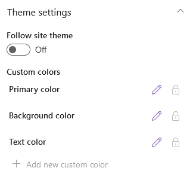
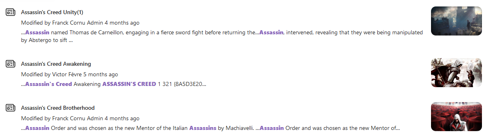
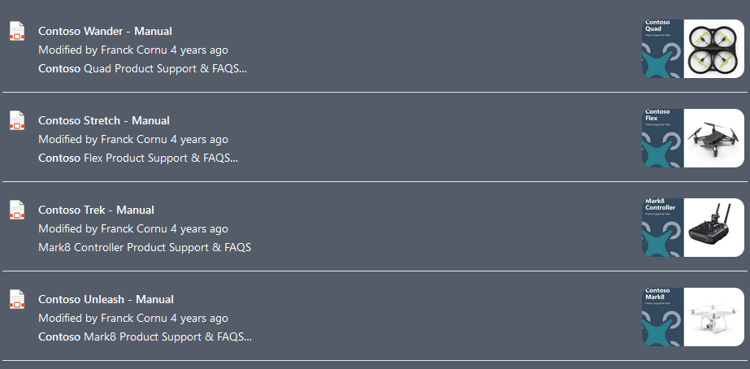
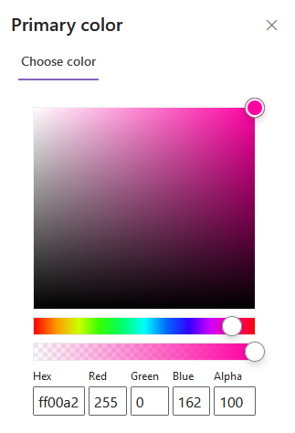
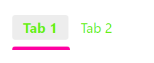

# Theming

By default, all Web Parts follow the SharePoint site theme/section background (i.e. inverted theme). However, you can override specific colors to better match to your context:

   
    

    

        
**🌕 Light mode**
   
        
    

    

        
**🌑 Inverted mode**
  
        
    

1. In the third configuration page in the property pane settings ➝ Disable **Follow site theme**
2. Edit colors (example on search verticals Web Part)

    
   
        
    

    

        
    

