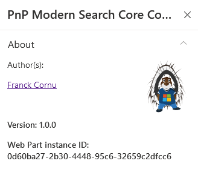

# Tips

## Get you Web Part instance ID {#tip-instanceid}

If there are multiple search box web parts on the page, you can differentiate them using their instance ID. This value can be retrieved in the last property pane page for all Web Parts.

 
    

