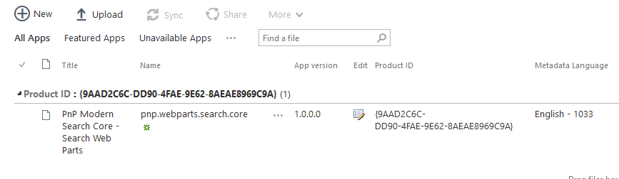
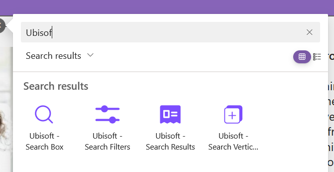

# Installation

1. Download the latest SharePoint Framework packages **pnp.webparts.search.core.sppkg** from the [GitHub repository](https://github.com/microsoft-search/pnp-modern-search-core-components/releases).
2. Add **pnp.webparts.search.core.sppkg** to the global tenant app catalog or a site collection app catalog. If you don't have an app catalog, follow this [procedure](https://docs.microsoft.com/en-us/sharepoint/use-app-catalog) to create one. 

    
 
        
    

    > * The packages are deployed in the general Microsoft 365 CDN meaning **we don't host any code**.

    > * For the **pnp.webparts.search.core.sppkg** package, you can choose to make the solution available in [all sites](https://docs.microsoft.com/en-us/sharepoint/dev/spfx/tenant-scoped-deployment) or force to install an app to the site every time.

    > * The solution asks the following API permissions by default to enhance the experience. These permissions are **not mandatory**. If you don't accept them, you will simply have less available features.

    > * You can approve scopes from the API Access screen in the SharePoint Admin Center: **https://&lt;tenant&gt;-admin.sharepoint.com/_layouts/15/online/AdminHome.aspx#/webApiPermissionManagement** If you'd like more details on this step, please see the [Approving Scopes](#approving-scopes) section below.

    | Requested API permission | Used for |
    | -------------- | --------- |
    | _User.Read_ | The Microsoft Graph Toolkit [persona card](https://docs.microsoft.com/en-us/graph/toolkit/components/person-card#microsoft-graph-permissions) in the people layout.  |
    | _People.Read_ | Same as above.
    | _Contacts.Read_ | Same as above.
    | _User.Read.All_ | Same as above.
    | _Files.Read.All_ | Allow search for files using Graph API (Drive / Drive Items).
    | _Mail.Read_ | Allow search for user's e-mail using Graph API (Messages).
    | _Calendars.Read_ | Allow search for user's calendar appointments using Graph API (Events).
    | _Sites.Read.All_ | Allow search for sites using Graph API (Sites / List Items).
    | _ExternalItem.Read.All_ | Allow search for connector items using Graph API (External Items).
    | _Bookmark.Read.All_ | Allow search for Bookmarks in Microsoft Search in your organization.
    | _Acronym.Read.All_ | Allow search for Acronyms in Microsoft Search in your organization.
    | _Chat.Read_ | Allow search for Teams messages.
    | _ChannelMessage.Read.All_ | Same as above.

## Add Web Parts to your site

To add them on a SharePoint page, edit the page page and search for _"PnP Modern Search Core Components"_: 

 
    

:::note
SharePoint Web Parts are meant for end-users to integrate them in their SharePoint pages.
:::

:::note
⚠️**PnP Modern Search Core Components Web Parts** are different from **[PnP Modern Search](https://microsoft-search.github.io/pnp-modern-search/)** regular Web Parts