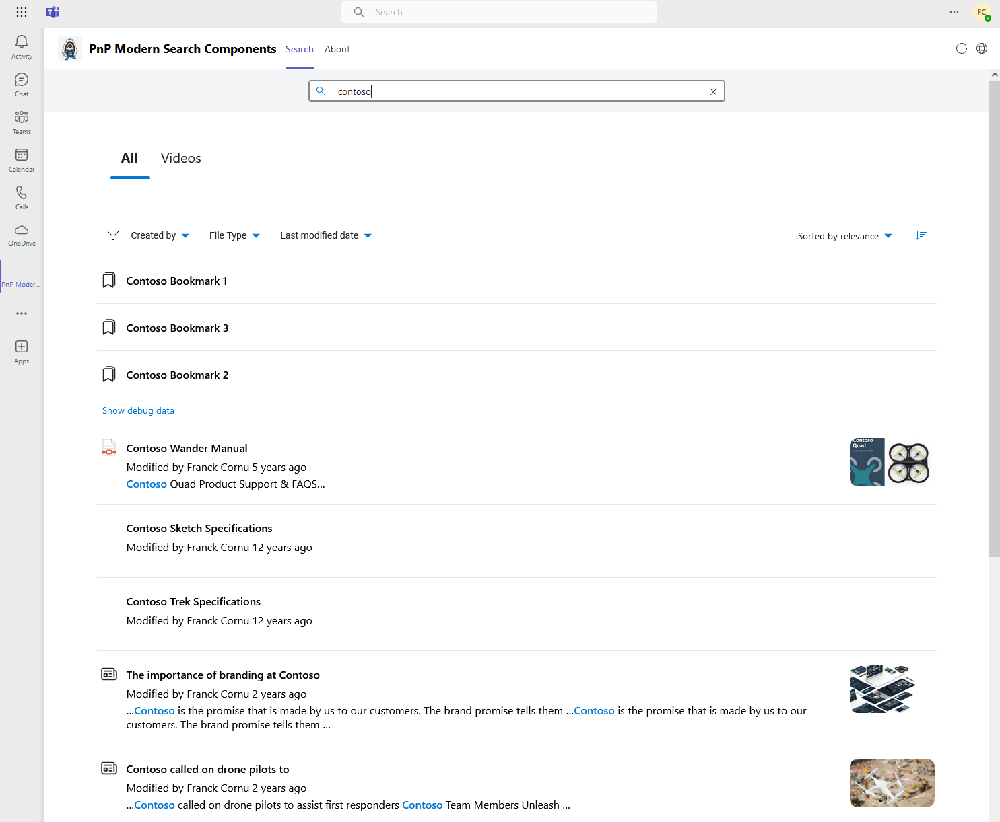
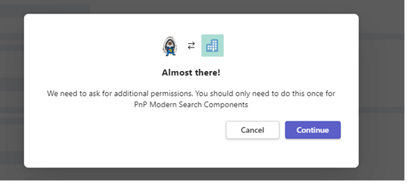
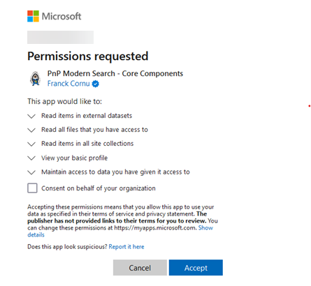

# Usage

A demo Microsoft Teams application package is provided with the solution:

    

It showcases the following concepts:

- Web components package consumption
- Theme handling
- Single-Sign On within Teams

## Deployment

To test it, you can either:

1. Get the latest package `appPackage.prod.zip` from the GitHub repository: [https://github.com/microsoft-search/pnp-modern-search-core-components/releases](https://github.com/microsoft-search/pnp-modern-search-core-components/releases)

2. Enable [custom app side loading](https://learn.microsoft.com/en-us/microsoftteams/platform/concepts/build-and-test/prepare-your-o365-tenant#enable-custom-teams-apps-and-turn-on-custom-app-uploading) in your Teams administration center and add the app manually.

3. [Deploy the application to the global Teams app catalog](https://learn.microsoft.com/en-us/microsoftteams/manage-apps?toc=%2Fmicrosoftteams%2Fplatform%2Ftoc.json&bc=%2FMicrosoftTeams%2Fbreadcrumb%2Ftoc.json) so it will be available for your users.

This application uses a dedicated multi-tenant Entra ID application with the predefined permissions. The first time you launch the solution, you will be asked to approve the application:

    

    

:::danger DOT NOT USE THIS APP IN PRODUCTION
This application is not suitable for production usage a it uses development infrastructure with no guarantee whatsoever. Its purpose is to show you the Teams integration with PnP Modern Search components without building hte application yourself. If you want to integrate the application into your environment, [please follow the development guide](../development-guide/teams/getting_started)
:::