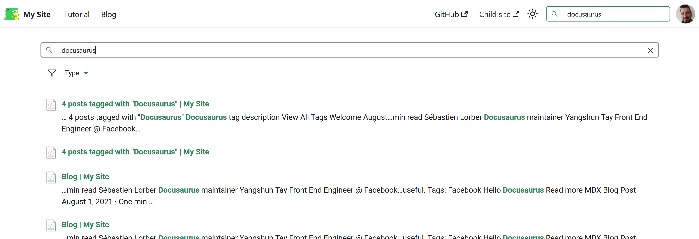

# PnP Modern Search Core Components - Docusaurus integration sample

This sample solution demonstrates the integration of the PnP Modern Search Core Components into a Docusaurus documentation static site. The following concepts are demonstrated:

- Consume PnP Modern Search Core components using the npm library as React components.
- Integrate with Docusaurus and Server Side Rendering.
- [Docusaurus Swizling](https://docusaurus.io/docs/swizzling) to integrate authentication.
- Deploy Docusaurus static site in an Azure App Service.
- Handle authentication with EasyAuth on Azure App Service.



## Prerequisites - Tooling

The following prerequisites need to be installed first on your machine to work locally:

- [Node.js v18 or later](https://nodejs.org/en/download/package-manager). You can also use [nvm](https://github.com/coreybutler/nvm-windows) on WIndows to easily manage Node.js versions on your machaine.
- [pnpm package manager](https://pnpm.io/) running `npm i -g pnpm`
- [PowerShell 7 (core)](https://learn.microsoft.com/en-us/powershell/scripting/install/installing-powershell-on-windows?view=powershell-7.4#install-powershell-using-winget-recommended) 

- Azure PowerShell modules installed:

```pwsh
Install-Module -Name Az.Websites -Force -Scope AllUsers
Install-Module -Name Az.Accounts -Force -Scope AllUsers
Install-Module -Name Az.Resources -Force -Scope AllUsers
```

## Prerequisites - Environment

The documentation is meant to be deployed and hosted in an Azure App Service. To be able to deploy it, you need to configure the environment accordingly following these steps in the target Azure tenant:

1. Create a new resource group. This resource group will be used to create resouces for the documentation site.
2. Create an Entra ID application for **deployment** and generate a new client secret (you'll need after). This application is used to deploy resources in the resource group **only**.
3. Grant write access to the Entra ID to resource group. In order to provision resources, you need to grant write access to the deployment Entra ID to the resource group using RBAC.
4. Create an Entra ID application for **search**.

    - Configure API permissions: The documentation uses web components and Microsoft Graph to provide a search capbility. You need to create a dedicated app in Entra ID with correct API permissions granted (**delegated**) (ex: `ExternalItem.Read.All` to search for external sources). Refer to [Microsoft Graph API](https://learn.microsoft.com/en-us/graph/api/resources/search-api-overview?view=graph-rest-1.0#scope-search-based-on-entity-types) reference to see all possible permissions regarding other desired entity types.

    - Configure redirect URL: in the _Authentication_ blade, also add the `http://localhost:3000` URL as Redirect URI. It will be used for development scenario, when the documentation is served locally.

## Development scenario

In this scenario, you work on the documentation form your local machine.

### Create .env file

In the `./samples/docusaurus` folder, create a `.env` file with the following values:

```
ENV_MSSearchAppClientId = <Entra ID application GUID for search> (ex: 02a3d6f6-903f-4535-830c-acce5cb079af)
ENV_MSSearchAppDomain = <Azure tenant domain> (ex: 61kxhg.onmicrosoft.com)
ENV_MSSearchAppTenantId = <Azure tenant ID> (ex: e4a439b4-3c43-4f98-a5fe-928d69237134)
ENV_SiteUrl = <Site URL after the documentation will be deployed, typically the static website URL from Azure App Service>
ENV_BaseUrl = The Docusaurus base URL. In the case the app is served from a reverse proxy (like an Azure Application Gateway), this corresponds to the proxy route. '/' by default.
ENV_MSSearchConnectionId= <The Microsoft Search connection id of the connector you created in the Microsoft Search admin center (ex: IntranetSitesCloud1)>
```

These values are used for the login process and will be replaced dynamically in the code when building the solution running either `pnpm run start` or `pnpm run build`.

### Install dependencies

From the `./samples/docusaurus` folder, run the following command:

- `pnpm i --ignore-workspace`

This will install all needed dependencies. 

### Serve the documentation locally

From the `./samples/docusaurus`, run the following commands:

- `pnpm run start`

It will serve the documentation at `http://localhost:3000`.

### Deploy the documentation

The documentation is hosted in a Azure App Service. You can deploy the documentation direcly from your machine using the following steps (the App Service must exist):

- From `./samples/docusaurus` folder, build the documentation using `pnpm run build`. This will create a `build` foder containing static site assets that ill be uploaded to the App Service and a basic Node.js server.

- In `/deploy` folder, create a `variables.local.ps1` file with the following variables:

| **Variable**                        | Description                                                                                       | Example                                |
|-------------------------------------|---------------------------------------------------------------------------------------------------|----------------------------------------|
| **ENV_AzDeployTenantId**            | The Azure tenant ID where the storage account belongs.                                            | "e4a439b4-3c43-..."                    |
| **ENV_AzDeploySubcriptionId**       | The Azure subscription ID to use when deploying resources.                                        | "9865d980-c3a7-..."                    |
| **ENV_AzDeployAppId**               | The Azure Entra ID application ID used to deploy resources.                                       | "cb8729e5-b339-..."                    |
| **ENV_AzDeployAppSecret**           | The Azure Entra ID application secret used to deploy resources.                                   | "KIz8Q~7_p..."                         | 
| **ENV_AzResourceGroupName**         | The Azure resource group name where the storage account belongs.                                  | "my-resource-group"                    |
| **ENV_AzWebAppName**                | The Azure App Service name.                                                                       | "MyWebApp"                             |

- In `/deploy` folder, run the `deploy.ps1 -Env LOCAL` command. This will upload files from the `build` folder to the App Service.

> If you don't want to use an Entra ID application for deployment, you can use the `-Manual` switch parameter like this `deploy.ps1 -Env LOCAL -Manual`. This will connect to the Azure tenant using **your own credentials**.
